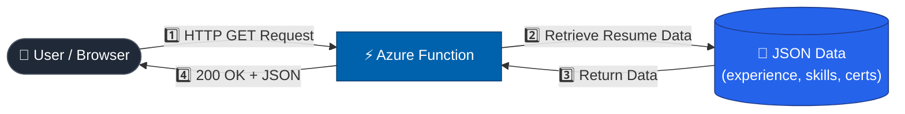
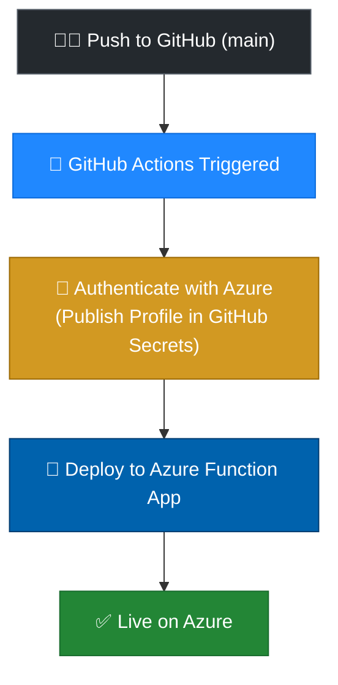

# 🚀 Serverless Resume API

**A cloud-native backend that serves my resume as JSON — hosted entirely on Microsoft Azure, deployed automatically via CI/CD.**

`Azure Functions` · `GitHub Actions` · `Serverless`

**[🔗 Live Endpoint](https://resume-api-30847.azurewebsites.net/api/cv)** &nbsp;|&nbsp; **[💻 GitHub Repo](https://github.com/moulisiddhu487-svg/azure-resume-api)**

---

## 📖 What Is It?

Instead of hosting a static PDF or HTML file, this project serves my professional resume data **dynamically as JSON**, over a standard `HTTP GET` request — a REST API hosted entirely on Microsoft Azure.

## 🎯 Why I Built It

As a Cloud & DevOps Engineer, I wanted a portfolio piece that shows **backend cloud architecture**, not just frontend design. It demonstrates:

- ⚡ **Serverless Computing** — no server management
- 🔐 **Infrastructure Configuration** — secure Azure resource setup
- 🔁 **CI/CD Automation** — zero-touch deployments via GitHub Actions
- 🌐 **API Security** — handling CORS in production

---

## 🏗️ Architecture

The whole thing is serverless — it scales automatically and costs **$0 when idle**.

1. **Trigger** — A browser sends an `HTTP GET` request to the Azure Function URL.
2. **Compute** — The Function wakes, runs, and retrieves the resume JSON (experience, skills, certifications).
3. **Response** — Returns `200 OK` with the JSON payload.
4. **Pipeline** — Every update pushed to GitHub is automatically built and deployed to Azure — no manual steps.

---

## 🔁 CI/CD Pipeline

Whenever resume data is updated in the repo, this workflow builds and deploys the new code to Azure automatically.

---

## 🛠️ How It Was Built

1. **Local Development** — Created an Azure Functions project locally via the Azure CLI; wrote the handler to return structured JSON.
2. **Resource Provisioning** — Set up a Resource Group, Storage Account, and Function App in the Azure Portal.
3. **CI/CD Setup**
   - Created a GitHub repository
   - Built a GitHub Actions workflow triggered on every push to `main`
   - Stored the Azure Publish Profile securely in GitHub Secrets
4. **Configuration** — Tuned Function App settings for correct routing and external HTTP access.

---

## 🚧 Problems Faced & Solutions

<table>
<tr>
<td width="50%" valign="top">

**🔴 SCM Authentication Error**

GitHub Actions couldn't authenticate with Azure — deployment kept failing.

**✅ Fix:** Downloaded the Function App's **Publish Profile** from Azure, mapped it to the `AZURE_FUNCTIONAPP_PUBLISH_PROFILE` GitHub Secret, and enabled **Basic Auth for SCM** in Azure Configuration.

</td>
<td width="50%" valign="top">

**🔴 CORS Policy Block**

Fetching the API from my frontend threw a CORS error in the browser console.

**✅ Fix:** Added my frontend URL (and `*` during testing) to **Allowed Origins** in the Azure Portal's CORS settings.

</td>
</tr>
</table>

---

## 🔮 Future Enhancements

- 🗄️ **Azure Cosmos DB** — fetch resume data from a NoSQL database instead of hardcoding it
- 📊 **Azure API Management** — add rate-limiting and track analytics on who views the resume

---

Built with ☁️ **Azure Functions** and 🔁 **GitHub Actions**

